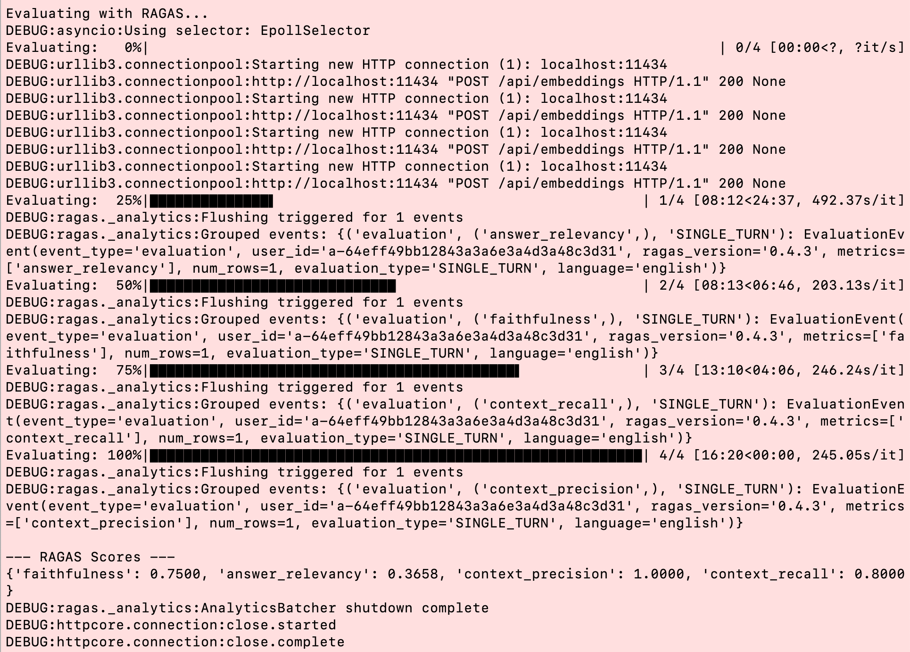

# AI Evaluation with RAGAS 

Environment for this: Ubuntu 22.04.4

## Install the following python packages

pip install pymupdf4llm chromadb langchain-text-splitters sentence_transformers ollama ragas

get the mistral LLM if you don't have it already,

ollama pull mistral

Run the ollama server

nohup ollama serve > ollama.out 2>&1 &

## Workflow

The script parsepdfembedtochromadb.py chunks the document KSM-01-26.pdf, creates embeddings and stores them in a chromadb vector database (chroma_db) to a collection called pdf_docs.  Chumk size is 500 chars with overlap of 50 chars.  This can be adjusted.

1. First run parsepdfembedtochromadb.py to create the embeddings
2. Then run queryevalutateragas.py to do the evaluation with RAGAS. 
   The output is the image shown under the Result section below.

## Architecture

```

                         ┌────────────────────┐
                         │     Evaluation     │
                         │     Dataset        │
                         │(Queries + Context) │
                         └─────────▲──────────┘
                                   │
                                   │
       ┌───────────────────────────┼───────────────────────────┐
       ▼                           ▼                           ▼
┌──────────────┐       ┌──────────────────┐        ┌───────────────────┐
│   RAG System │       │  RAG Evaluation  │        │  Metrics Output   │
│ (Retrieval + │       │    Engine (RAGAS)│        │ (JSON / Dataframe)│
│  LLM Answer) │       └───────┬──────────┘        └─────────┬─────────┘
└─────▲────────┘               │                              │
      │                        │                              │
      │        ┌───────────────┴────────────────┐             ↓
      │        ▼                                ▼     Metrics: Faithfulness,
      │   Retriever (Vector DB search)   LLM Generator     Answer Relevancy,
      │     (embeddings + similarity)           (LLM)       Context Precision,
      │                                                        Context Recall
      │                                                       (from evaluator)
      └──────────────────────────────────────────────────────────┘


```

## Question and Answer

### Question

question: Give me information on Auroville

### Answer from LLM (mistral)

Answer: Here's what I found in the context:

Auroville was founded by The Mother (Mirra Alfassa). The foundation stone for Auroville was laid on 20th February, 1968. The terrain was rough and land had to be levelled before construction began. The event was conducted solemnly and smoothly.

In the late 1960s, Dayanand Mukund Jamalabad was authorized by "The Mother" (Mirra Alfassa) to procure lands for Auroville in Pondicherry, now renamed Puducherry.

Let me know if you'd like more information!

## Result

The output of each and explanation for evalution with Mistral  is provided below.

<div align="center">
  
</div>

### Output of evaluation with Mistral

{'faithfulness': 0.7500, 'answer\_relevancy': 0.3658, 'context\_precision': 1.0000, 'context\_recall': 0.8000}

* * *

# 1️⃣ Faithfulness (`faithfulness: 0.7500`)

-   Measures **how factually correct the LLM’s response is** with respect to the context or knowledge base.
    
-   0 → completely unfaithful
    
-   1 → fully faithful
    
-   `0.75` → mostly accurate but some hallucination or minor errors
    

> Example: If your LLM response contains a detail that **doesn’t exist in the retrieved docs**, faithfulness drops.

* * *

# 2️⃣ Answer Relevancy (`answer_relevancy: 0.3658`)

-   Measures **how relevant the response is to the user’s query**.
    
-   0 → unrelated answer
    
-   1 → highly relevant answer
    
-   `0.3658` → the model **partially addressed the query**, but mostly off-target
    

> Example: You ask about “Python installation,” and the model talks about “Linux OS” generally—low relevancy.

* * *

# 3️⃣ Context Precision (`context_precision: 1.0000`)

-   Measures **how much of the retrieved context included in the answer is actually correct / used properly**.
    
-   1 → all context references in the answer are correct
    
-   0 → answer misuses context
    
-   `1.0` → perfect precision; no hallucination from the retrieved context
    

> Example: If your answer cites retrieved text exactly and correctly, precision = 1.

* * *

# 4️⃣ Context Recall (`context_recall: 0.8000`)

-   Measures **how much of the relevant retrieved context was actually used in the answer**.
    
-   1 → all relevant context used
    
-   0 → none of it used
    
-   `0.8` → most of the useful retrieved context was incorporated
    

> Example: If the system retrieved 5 key facts and the answer used 4, recall = 0.8.

* * *

# 🧠 Quick analogy (like search engine evaluation)

-   **Precision** → “Of the context I used, was it correct?”
    
-   **Recall** → “Did I use all the relevant context I had?”
    
-   **Faithfulness** → “Did I hallucinate anything outside context?”
    
-   **Answer relevancy** → “Did I actually answer the user’s question?”
    

* * *

In your example:

-   `faithfulness = 0.75` → mostly factual
    
-   `answer_relevancy = 0.3658` → response was **not very on-topic**
    
-   `context_precision = 1.0` → context was used correctly
    
-   `context_recall = 0.8` → most relevant context was incorporated
    

✅ Interpretation: The model **used context correctly but didn’t fully answer the question**—common in retrieval-augmented setups when the retrieved docs are partially relevant.
